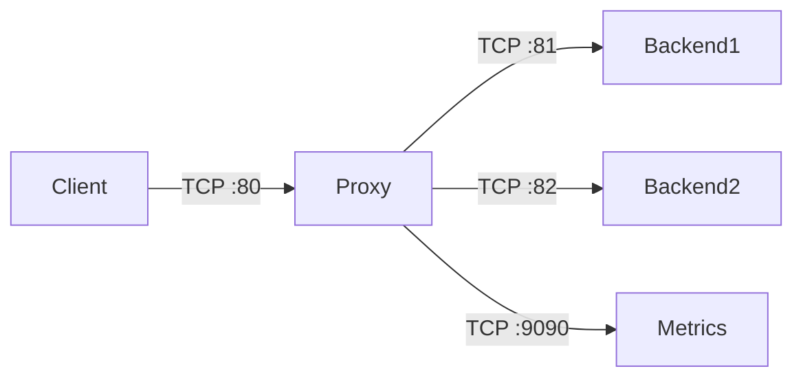

# Load Balancer & Reverse Proxy

> **A production-grade TCP reverse proxy and load balancer, built from scratch in Rust.**
> Every layer — TCP accept, HTTP parsing, load balancing, health checks — is hand-implemented.

```
curl http://localhost:80 ──> proxy ──> backend:81
```

---

## What It Does

Accepts HTTP connections, parses request headers incrementally as bytes arrive, selects a backend via round-robin (skipping unhealthy ones), forwards the request verbatim, streams the response back to the client — then keeps the connection alive for the next request.

All configurable through a TOML file. All observable via Prometheus metrics.

---

## Architecture



Each connection runs through an explicit state machine:

```
ReadingHeaders → ReadingBody → WaitingBackend → ReadingResponseHeaders → ReadingResponseBody → KeepAliveDecision
                                                                                                        │
                                                                                     (keep-alive) ──────┘
                                                                                     (close) ──── Closed
```

### Core Modules

| Module | Responsibility |
|--------|---------------|
| `main.rs` | TCP listener, per-connection state machine |
| `lib.rs` | Incremental HTTP header parser (`HeadParser`, `RequestMeta`) |
| `lb/mod.rs` | Backend pool, round-robin, connection pool, passive + active health checks |
| `config.rs` | TOML configuration deserialization |

### Tech Stack

| Layer | Choice |
|-------|--------|
| Language | Rust (edition 2024) |
| Async Runtime | Tokio 1.49 |
| HTTP Parsing | Custom incremental parser (no regex, no hyper) |
| Configuration | TOML via serde |
| Logging | tracing (structured, env-filter) |
| Metrics | Prometheus text format on `:9090/metrics` |

---

## Features

- **Incremental HTTP Parser** — processes bytes as they arrive; handles `Content-Length` and `Transfer-Encoding: chunked`
- **Header-Verbatim Forwarding** — preserves every header (Auth, Cookie, Accept, …)
- **Keep-Alive** — parses response headers, reads exact body length, reuses TCP connection for pipelined requests
- **Round-Robin Load Balancing** — lock-free atomic counter across all connections
- **Connection Pooling** — idle backend TCP connections are recycled instead of re-established
- **Passive Health Checks** — marks backends unhealthy on connection failure, retries cooldown
- **Active Health Checks** — background task sends `GET /health` probes every N seconds
- **TOML Config** — listen address, backends, health check interval all in `proxy.toml`
- **Prometheus Metrics** — `proxy_requests_total` served on a separate HTTP endpoint
- **Structured Logging** — `RUST_LOG=info` / `RUST_LOG=debug` for full observability

---

## Quick Start

> **Note:** Ports 80/81 require `sudo`. For testing without root, edit `proxy.toml` to use higher ports (see below).

### Option 1 — Run with root (default config)

```bash
# Start a test backend
python -m http.server 81 &

# Start the proxy
sudo RUST_LOG=info cargo run --bin proxy

# Send a request through it
curl http://localhost:80

# View metrics
curl http://localhost:9090/metrics
```

### Option 2 — Run without root (recommended for testing)

Edit `proxy.toml`:
```toml
listen = "127.0.0.1:8080"
backends = ["127.0.0.1:8081"]
```

```bash
# Start a test backend
python3 -m http.server 8081 --bind 127.0.0.1 &

# Start the proxy
RUST_LOG=info cargo run --bin proxy

# Send a request through it
curl http://127.0.0.1:8080

# View metrics
curl http://127.0.0.1:9090/metrics
```

### Try load balancing across two backends

Edit `proxy.toml`:
```toml
listen = "127.0.0.1:8080"
backends = ["127.0.0.1:8081", "127.0.0.1:8082"]
```

```bash
# Start two backends
python3 -m http.server 8081 --bind 127.0.0.1 &
python3 -m http.server 8082 --bind 127.0.0.1 &

# Watch round-robin in action
for i in $(seq 10); do
  curl -s http://127.0.0.1:8080 | head -1
done

# Check metrics to see requests distributed
curl -s http://127.0.0.1:9090/metrics | grep proxy_requests
```

---

## Project Structure

```
proxy/
├── proxy.toml              # Configuration
├── src/
│   ├── main.rs             # TCP listener & state machine
│   ├── lib.rs              # HTTP header parser
│   ├── config.rs           # Config deserialization
│   ├── check_valid.rs      # Utility helpers
│   └── lb/
│       └── mod.rs          # Backend pool, connection pool, health checks
│
client/                     # Test TCP client
exercise/                   # Scratch code
codebase-docs/              # Auto-generated documentation
```

---

## Configuration (`proxy.toml`)

```toml
listen = "127.0.0.1:80"
backends = ["127.0.0.1:81"]
health_check_interval_secs = 10
health_check_path = "/health"
```

Override the config path: `PROXY_CONFIG=custom.toml cargo run --bin proxy`

---

## Why This Exists

Built as a hands-on exploration of:

- **Systems programming** — TCP, sockets, async I/O in Rust
- **HTTP at the wire level** — request/response framing, chunked encoding, keep-alive semantics
- **State machine design** — modeling protocol flows as explicit states
- **Distributed systems** — load balancing algorithms, health checks, connection pooling
- **Production readiness** — structured logging, metrics, config-driven design

---

## License

MIT
