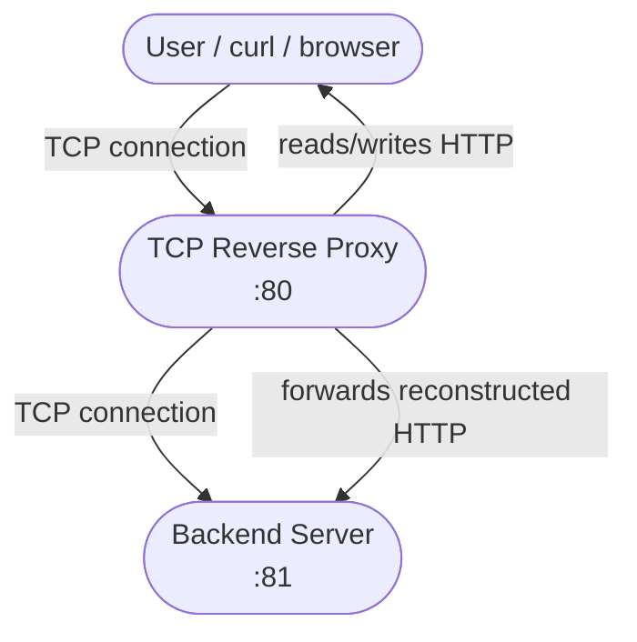
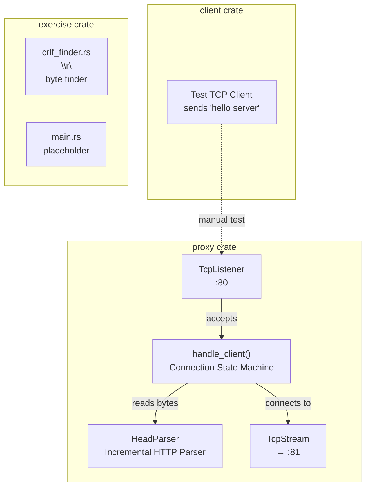
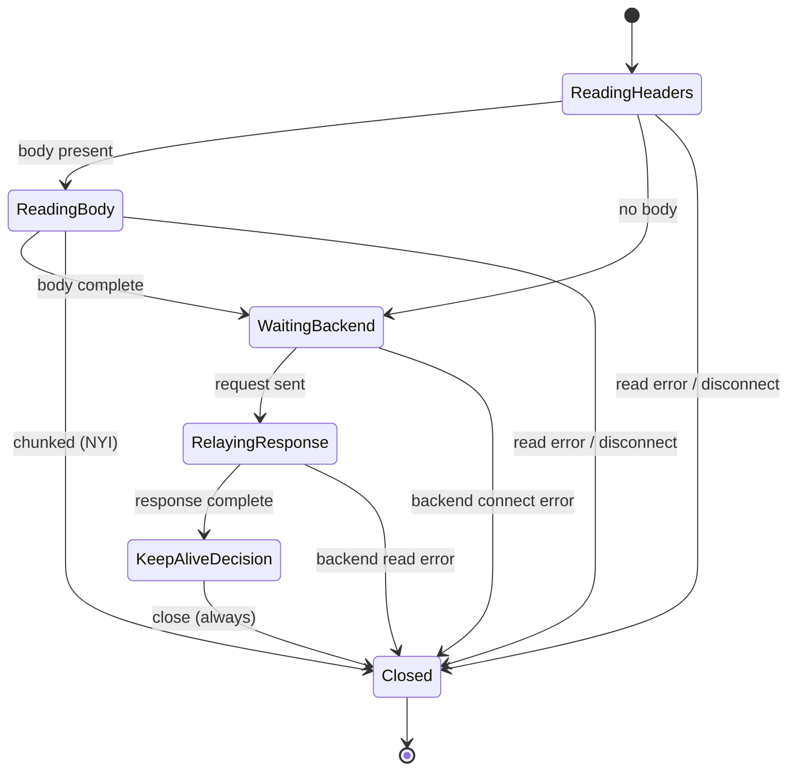
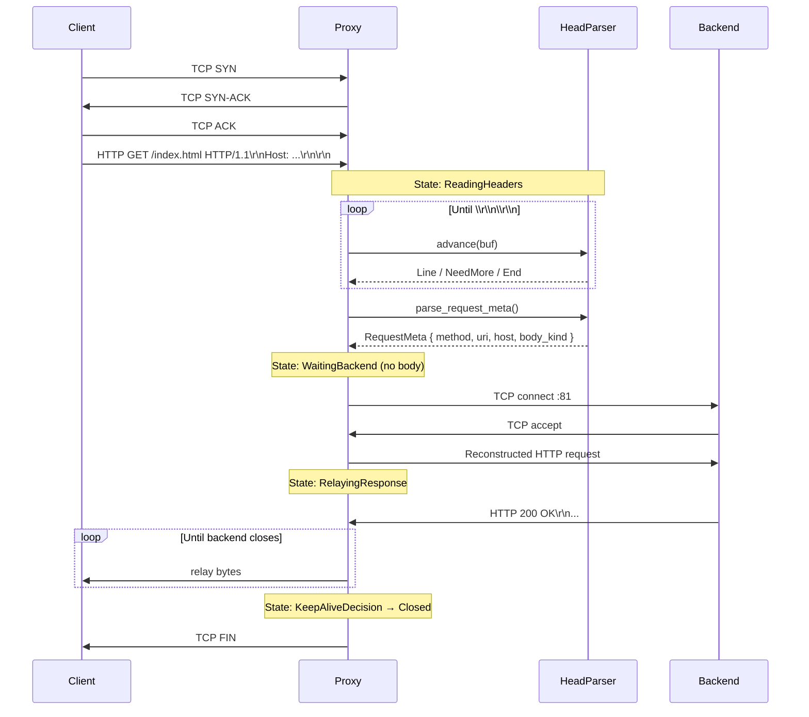
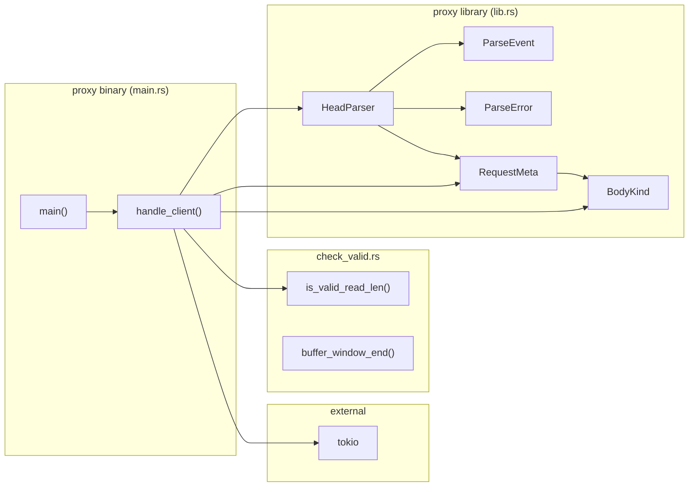

# Architecture

## System Context (C4 Level 1)

## Container Diagram

## Connection State Machine

This is the core of the proxy. Each accepted TCP connection is wrapped in an async task that runs this state machine:

### State Details

| State | Responsibility | Data Carried |
|-------|---------------|--------------|
| `ReadingHeaders` | Read raw bytes, feed to `HeadParser` until headers complete | `buf: Vec<u8>`, `parser: HeadParser` |
| `ReadingBody` | Accumulate body bytes based on `Content-Length` or `Chunked` | `RequestMeta`, `body: Vec<u8>` |
| `WaitingBackend` | Connect to backend, reconstruct and forward HTTP request | `RequestMeta`, `body: Vec<u8>` |
| `RelayingResponse` | Stream bytes from backend socket to client socket | `backend_socket: TcpStream` |
| `KeepAliveDecision` | Decide whether to reuse connection (currently always closes) | Nothing |
| `Closed` | Terminal — return from handler | Nothing |

## Data Flow (End-to-End Request)

## Module Dependency Graph

## Key Design Decisions

1. **Reconstructing vs. Passthrough** — The proxy parses the HTTP request, extracts metadata, then *reconstructs* the request to send to the backend. This is more complex than raw passthrough but enables future load-balancing features (header injection, URI rewriting, etc.). A simpler `handle_client1` alternative using `copy_bidirectional` exists but is unused.

2. **Incremental Parsing** — `HeadParser` does not require the entire request to arrive before parsing. It processes byte-by-byte, yielding `NeedMore` when incomplete. This enables pipelining and avoids buffering the full request unnecessarily.

3. **State Machine per Connection** — Each connection has its own state machine instance (stack-allocated in `handle_client`). This is simple and correct but means all features (parsing, connection, relaying) are in one function. Future extraction into separate modules or actors would improve testability.
